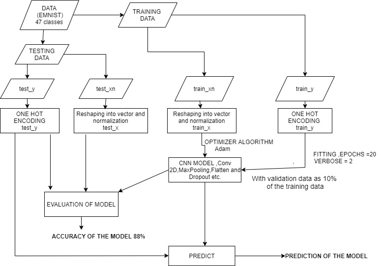

# Handwriiten_Character_Recognition_emnis_balanced
This project embarks on predicting the outcomes of  handwritten characters using a deep learning approach. The main idea behind the project is to develop a model which can distinctly identify each and every character with a high-level accuracy .

### _Documentation of the Project :_

### AIM : HANDWRITTEN CHARACTER RECOGNITION USING CNN AND TENSORFLOW .
_CONTENT
1)ABSTRACT
2)INTRODUCTION
3)PLATFORM USED
4)PRODUCT REQUIREMENTS
5)TECHNICAL REQUIREMENTS
6)IMAGE PRE-PROCESSING
7)OBJECT DETECTION
8)MODULE DESCRIPTION
ONE- HOT ENCODING
NORMALIZATION OF THE INPUT / TRAINING EXAMPLES
BUILDING OUR NEURAL NETWORK MODEL
9)ALGORITHM USED
Adam
LOSS FUNCTION
METRICS
10)IMPLEMENTATION
11)TESTING/EVALUATING THE MODEL
12)WORK-FLOW DIAGRAM OF THE PROJECT
13)RESULTS
14)CONCLUSION
15)FUTURE SCOPE
16)REFERENCES
17)CODE’s GITHUB LINK_

### 1)ABSTRACT
The paper embarks on predicting the outcomes of  handwritten characters using a deep learning approach. The main idea behind the project is to develop a model which can distinctly identify each and every character with a high-level accuracy . 
### 2)INTRODUCTION
 We will create an Hand-written Character Recognition Classifier to classify the various  images taken from the EMNIST Dataset (The dataset is divided into 512 training batches , one validation batch with 112799 images  and one test batch,with 18799 images. The test batch contains exactly 18799  randomly-selected images from each character (both in UpperCase and LowerCase characters. The training batches contain the remaining images in random order, but some training batches may contain more images from one class than another. Between them, the training batches contain exactly 2400 images from each class. EMNIST has 47 classes in total ,they are - A-Z ,a-z, 0-9 etc .) and hence send back the result which will have a better accuracy . For handwritten character classification there are many algorithms like OCR ,Logistic Regression ,CNN , python package with a basic classifier etc. But we will be using CNN (Convolutional Neural Network). For the above handwritten character classification algorithms they give  more error at the prediction time, while in CNN since it is the transfer learning algorithm it will learn more data in the handwritten character classification while at the prediction time and it will give more good classification accuracy compared to other algorithms during testing .We are using two hidden layers for our neural network . The advantage of using this classifier is that the weights trained on handwritten character classification datasets can be used for the encoder. This can be considered a benefit as the handwritten character classification datasets are typically larger, such that the weights learned using these datasets are likely to be more accurate.

### 3) PLATFORM USED - 
GOOGLE COLAB (Colaboratory is a Google research project created to help disseminate machine learning education and research. It's a Jupyter notebook environment that requires no setup to use and runs entirely in the cloud.) We are saving the file in the .ipynb extension .We can use it not only for building models for machine learning but for coding in various languages and other forms of work as well .
 
### 4)PRODUCT REQUIREMENTS -  
Server , Images/Objects , Large dataset ,good RAM ,high Graphical Processing Units (GPUs) and a comparatively good CPU and a TPU(Tensor Processing unit )etc.
 
### 5)TECHNICAL REQUIREMENTS -
Latest version of TensorFlow and Keras installed .Wide a variety of handwritten character images on which the classification will be done .
Libraries include :
 
● 	Tensorflow
● 	OpenCV
● 	Tensorflow.keras.datasets
● 	Tensorflow.keras.utils
● 	Matplotlib
● 	Tensorflow.keras.models
● 	Tensorflow.keras.layers
 
 
 ### 6)IMAGE PRE-PROCESSING 
An image is nothing more than a two dimensional array of numbers (or pixel) ranging between 0 and 255. It is defined by the mathematical function f(x,y) where x and y are the two coordinates horizontally and vertically .The value of f(x,y) at any given point is giving the pixel value at that point of an image . In our model we have pre-processed the image by reading the image and then resizing /reshaping it ,removing noise (denoise), blurry vision etc .

### 7)OBJECT DETECTION
In our basic handwritten character recognition model , we have used one input layer ,two hidden layers and an output layer with different activation functions in our Neural Network model to evaluate , predict the accuracy of our trained data to perfectly recognize/detect the particular character from theEMNIST dataset . Below is the image of the plot where it displays the first 15 testing examples  that shows how well our model predicts the given pictures to the actual picture etc .

### 8)MODULE DESCRIPTION -
 
* 	ONE HOT ENCODING - One hot encoding is a process by which categorical variables are converted into a form that could be provided to ML algorithms to do a better job in prediction. The categorical value represents the numerical value of the entry in the dataset.
We will convert our each train_y and test_y labels in a list of 47  binary elements .It will help our neural network to understand which switch is ON/OFF and thereby will do a better job in prediction also .
 
* 	NORMALIZATION OF THE TRAINING /TESTING EXAMPLES - Normalization is a technique often applied as part of data preparation for machine learning. The goal of normalization is to change the values of numeric columns in the dataset to use a common scale, without distorting differences in the ranges of values or losing information.
We will normalize our train_x and test_x  examples (after they have been converted to their vectorized form) ie . reduce each image's pixel value to a larger extent to enhance our neural network . We will use the formula - 
train_xn=train_xn.astype(‘float32’)
train_xn /=255
test_xn=test_xn.astype(‘float32’)
test_xn /=255
 
* 	BUILDING OUR NEURAL NETWORK MODEL -
This is the vital part of our entire project . We will be using Sequential Class which forms a cluster of layers that is linearly stacked into tf.keras.models followed by Dense layer ,Convolution,Pooling etc. Dense layer is the regular deeply connected neural network layer. It is the most common and frequently used layer. Dense layer does the below operation on the input and returns the output.
 
The part of the code which shows the above implementation is :
 ### Compile the model 
model = Sequential()                                                                    
model.add(Conv2D(filters=128, kernel_size=(5,5), padding = 'same', activation='relu',input_shape=(HEIGHT, WIDTH,1))) model.add(MaxPooling2D(pool_size=(2,2), strides=(2,2)))   model.add(Conv2D(filters=64, kernel_size=(3,3) , padding = 'same', activation='relu')) model.add(MaxPooling2D(pool_size=(2,2))) model.add(Flatten()) 
model.add(Dense(units=128, activation='relu')) model.add(Dropout(.5)) model.add(Dense(units=num_classes, activation='softmax'))                     
model.summary () # to display the architecture of the model  
model.compile(loss='categorical_crossentropy', optimizer='adam', metrics=['accuracy'])

### 9)ALGORITHM USED :
 
1.	Adam - Adam is an optimization algorithm that can be used instead of the classical stochastic gradient descent procedure to update network weights iterative based in training data.The attractive benefits of using Adam on non-convex optimization problems are well suited for problems that are large in terms of data and/or parameters , invariant to diagonal rescale of the gradients, hyper-parameters have intuitive interpretation and typically require little tuning , appropriate for problems with very noisy/or sparse gradients,Computationally efficient.
 
2.	Loss function - This measures how accurate the model is during training . Here the categorical_crossentrophy is a loss function that is used for single label categorization. This is when only one category is applicable for each data point. In other words, an example can belong to one class only. It is used to minimize the difference between the actual and predicted value and to get a greater accuracy model .
 
3.	Metrics - Used to monitor the training and testing steps. The following example uses accuracy ,the fraction of the images that are correctly classified .Accuracy is the number of correctly predicted data points out of all the data points.
 
 
### 10)IMPLEMENTATION -
 
Train the model to fit the dataset  by using the normalized value of the train_x and the encoded version of the train_y for each example and using the hyperparameter the epoch which is usually initialized before training or implementing the model .An epoch is a term used in machine learning and indicates the number of passes of the entire training dataset the machine learning algorithm has completed. Datasets are usually grouped into batches (especially when the amount of data is very large).In our example we have used epoch as 20 .
 
11)TESTING / EVALUATING THE MODEL -
 
We will evaluate the model with the help of the evaluate function and using the parameters train_x and test_y .The function does the forward pass to understand the prediction of the model and it compares with the actual y_labels .
If the accuracy obtained at this stage is equal or almost significant to the result we got during compilation or fitting, then we can clearly say our model has trained itself or else our model has just memorized the training set and hence a not-good accuracy .
  
### 12)WORK-FLOW DIAGRAM OF THE PROJECT -
 
 
 
### 13)RESULTS 
We will use the predict function along with the parameter being only the normalized version of test_x and since we naturally don't compare with the y labels in prediction , therefore we are not using it also .

After fitting the model with the hyperparameters of validation split of 0.10(from the testing batch)  , epoch number = 20 ,batch_size =512 and verbose =2 , we got two graphs for the model.
Graph for the classification accuracy
Graph for the cross-entropy loss

Below are the screenshots of the predictions of the external images that were feeded into the model with an average accuracy of more than 88% accuracy .
  
  
    

### 14)CONCLUSION 
With this , our handwritten character recognition classification algorithm has worked successfully for 26 LETTERS (in upper case and lower case) , digits  classification images in the EMNIST dataset with an accuracy of 75 % approx .
We can change this accuracy for the betterment of our model by changing the hyperparameters or by using a better algorithm , by working on a better and more diverse dataset etc .

### 15)FUTURE SCOPE
Researchers all over the world are still working on creating models for handwritten characters classification that mimic the human brain. They are using neural networks, AI, ML, computer vision, and many other technologies in this research. Handwritten character recognition is an important research and application area on pattern recognition theory, which plays an important role in realizing automation of inputting character at all cases.In the future, we may come across robots that would be capable of performing recognizing patterns just like humans.
### 16)REFERENCES
https://www.google.com/search?q=algorithms+for+handwritten+character+recognition&rlz=1C1SQJL_enIN795IN795&oq=alg&aqs=chrome.0.69i59j69i57j69i59j69i61j69i60j69i65l2j69i61.3820j0j7&sourceid=chrome&ie=UTF-8
https://www.pyimagesearch.com/2014/06/02/opencv-load-image/
https://towardsdatascience.com/random-initialization-for-neural-networks-a-thing-of-the-past-bfcdd806bf9e
https://www.google.com/search?rlz=1C1SQJL_enIN795IN795&sxsrf=ALeKk01tgV8JrVkf_UKfx0519XDKQzy4TQ%3A1599248486773&ei=ZphSX_DiLoXorQH94ZvgBA&q=how+to+convert+an+image+such+that+the+background+is+black+and+the+object+is+white+in+ml&oq=how+&gs_lcp=CgZwc3ktYWIQAxgCMgQIIxAnMgQIIxAnMgQIIxAnMgQIABBDMgUIABCRAjIFCAAQkQIyBAgAEEMyBwgAEBQQhwIyBwgAEBQQhwIyAggAOggIABCxAxCDAToLCC4QsQMQxwEQowJQyRJYnRdgoy9oAHAAeACAAZgCiAG4CJIBAzItNJgBAKABAaoBB2d3cy13aXrAAQE&sclient=psy-ab
https://www.nist.gov/itl/products-and-services/emnist-dataset#:~:text=The%20EMNIST%20Balanced%20dataset%20contains,a%20single%2026%2Dclass%20task.
https://towardsdatascience.com/image-pre-processing-c1aec0be3edf
https://heartbeat.fritz.ai/how-to-replace-backgrounds-in-photos-with-machine-learning-6396fc518384
Google
deeplearning.ai

### Link for Technical Design Document for this project :

https://docs.google.com/document/d/1pPymaaNAMrfdJrinkv3FLH83j-2szyCn3bU2qzpFuF0/edit

### _If you've read it so far , Kudos to you . Happy Learning !_

